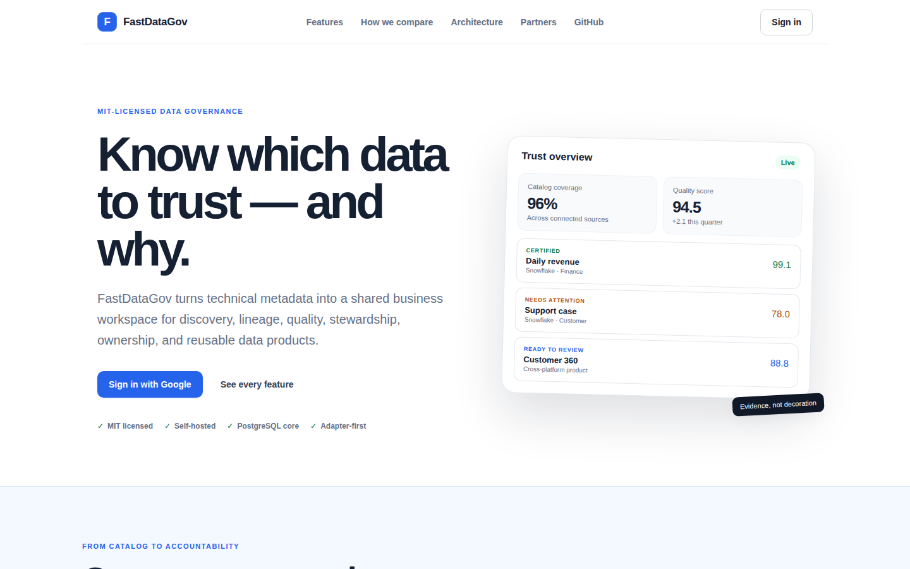
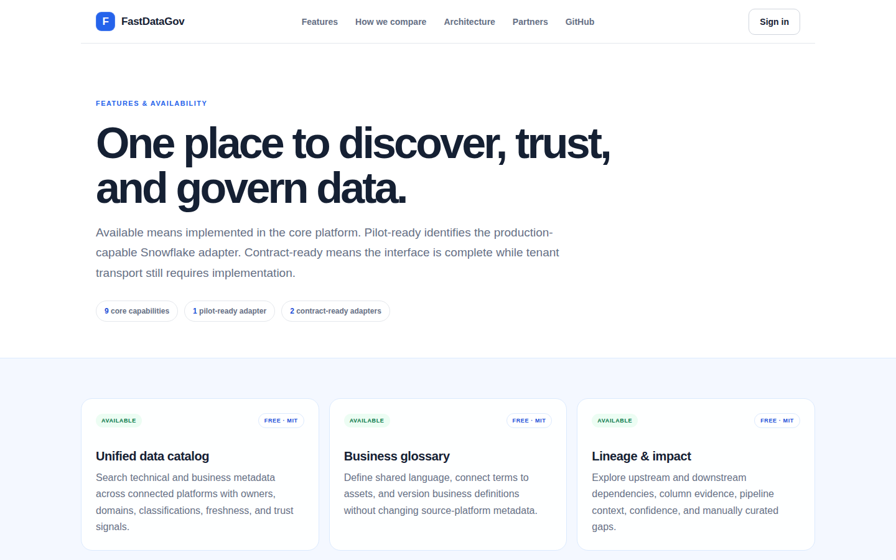
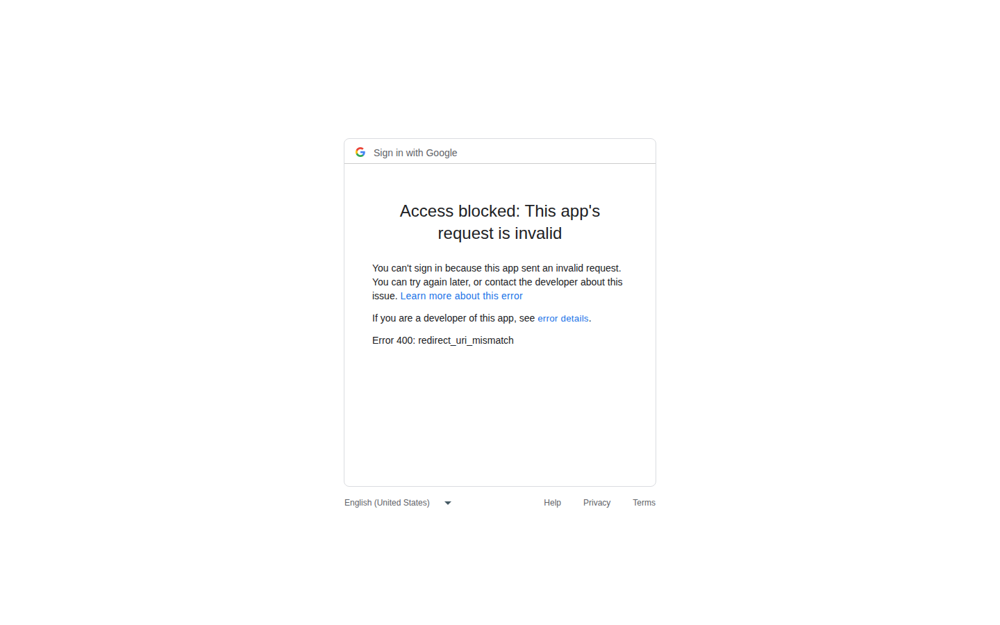
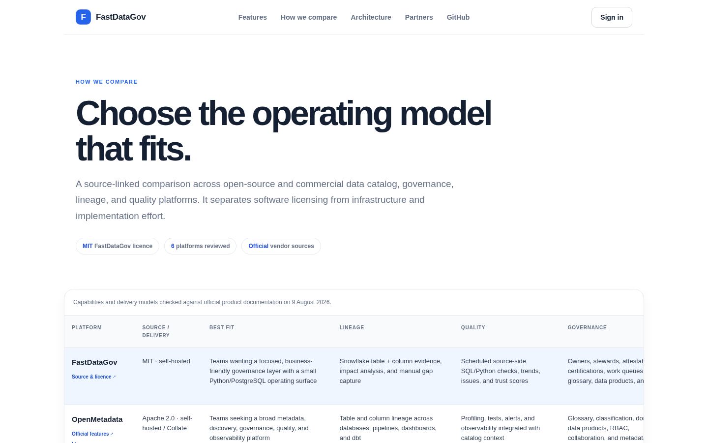

# FastDataGov Platform Guide

**Published:** 2026-08-19
**Platform:** [https://datagov.fastsme.com](https://datagov.fastsme.com)
**Source:** [github.com/predictivelabsai/FastDataGov](https://github.com/predictivelabsai/FastDataGov)

## Platform overview

FastDataGov is an open-source, business-friendly data governance platform built with FastHTML, PostgreSQL, and Python. It provides a unified catalog, lineage, data quality, stewardship, ownership, certification, and access-request experience across connected data platforms.

This visual guide was reviewed against the live product using Playwright. Screens and available navigation can vary by account, role, and deployment configuration.

## 1. Know which data to trust — and why.

MIT-LICENSED DATA GOVERNANCE Know which data to trust — and why. FastDataGov turns technical metadata into a shared business workspace for discovery, lineage, quality, stewardship, ownership, and reusable data products. Sign in with Google See every feature MI

Screen reviewed at: [https://datagov.fastsme.com/](https://datagov.fastsme.com/)

## 2. One place to discover, trust, and govern data.

FEATURES & AVAILABILITY One place to discover, trust, and govern data. Available means implemented in the core platform. Pilot-ready identifies the production-capable Snowflake adapter. Contract-ready means the interface is complete while tenant transport stil

Screen reviewed at: [https://datagov.fastsme.com/features](https://datagov.fastsme.com/features)

## 3. Access blocked: This app's request is invalid

Sign in with Google Access blocked: This app's request is invalid You can't sign in because this app sent an invalid request. You can try again later, or contact the developer about this issue. Learn more about this error If you are a developer of this app, se

Screen reviewed at: [https://accounts.google.com/signin/oauth/error?authError=ChVyZWRpcmVjdF91cmlfbWlzbWF0Y2gSsAEKWW91IGNhbid0IHNpZ24gaW4gdG8gdGhpcyBhcHAgYmVjYXVzZSBpdCBkb2Vzbid0IGNvbXBseSB3aXRoIEdvb2dsZSdzIE9BdXRoIDIuMCBwb2xpY3kuCgpJZiB5b3UncmUgdGhlIGFwcCBkZXZlbG9wZXIsIHJlZ2lzdGVyIHRoZSByZWRpcmVjdCBVUkkgaW4gdGhlIEdvb2dsZSBDbG91ZCBDb25zb2xlLgogIBptaHR0cHM6Ly9kZXZlbG9wZXJzLmdvb2dsZS5jb20vaWRlbnRpdHkvcHJvdG9jb2xzL29hdXRoMi93ZWItc2VydmVyI2F1dGhvcml6YXRpb24tZXJyb3JzLXJlZGlyZWN0LXVyaS1taXNtYXRjaCCQAypACgxyZWRpcmVjdF91cmkSMGh0dHBzOi8vZGF0YWdvdi5mYXN0c21lLmNvbS9hdXRoL2dvb2dsZS9jYWxsYmFjazKkAggBErABCllvdSBjYW4ndCBzaWduIGluIHRvIHRoaXMgYXBwIGJlY2F1c2UgaXQgZG9lc24ndCBjb21wbHkgd2l0aCBHb29nbGUncyBPQXV0aCAyLjAgcG9saWN5LgoKSWYgeW91J3JlIHRoZSBhcHAgZGV2ZWxvcGVyLCByZWdpc3RlciB0aGUgcmVkaXJlY3QgVVJJIGluIHRoZSBHb29nbGUgQ2xvdWQgQ29uc29sZS4KICAabWh0dHBzOi8vZGV2ZWxvcGVycy5nb29nbGUuY29tL2lkZW50aXR5L3Byb3RvY29scy9vYXV0aDIvd2ViLXNlcnZlciNhdXRob3JpemF0aW9uLWVycm9ycy1yZWRpcmVjdC11cmktbWlzbWF0Y2g&flowName=GeneralOAuthLite&client_id=887059023987-2a7spj1m82eivobdbt1itb3cqca6tpt1.apps.googleusercontent.com&aes=AVQXgOChJOMZ4fjgipe8Y2K9Xld-](https://accounts.google.com/signin/oauth/error?authError=ChVyZWRpcmVjdF91cmlfbWlzbWF0Y2gSsAEKWW91IGNhbid0IHNpZ24gaW4gdG8gdGhpcyBhcHAgYmVjYXVzZSBpdCBkb2Vzbid0IGNvbXBseSB3aXRoIEdvb2dsZSdzIE9BdXRoIDIuMCBwb2xpY3kuCgpJZiB5b3UncmUgdGhlIGFwcCBkZXZlbG9wZXIsIHJlZ2lzdGVyIHRoZSByZWRpcmVjdCBVUkkgaW4gdGhlIEdvb2dsZSBDbG91ZCBDb25zb2xlLgogIBptaHR0cHM6Ly9kZXZlbG9wZXJzLmdvb2dsZS5jb20vaWRlbnRpdHkvcHJvdG9jb2xzL29hdXRoMi93ZWItc2VydmVyI2F1dGhvcml6YXRpb24tZXJyb3JzLXJlZGlyZWN0LXVyaS1taXNtYXRjaCCQAypACgxyZWRpcmVjdF91cmkSMGh0dHBzOi8vZGF0YWdvdi5mYXN0c21lLmNvbS9hdXRoL2dvb2dsZS9jYWxsYmFjazKkAggBErABCllvdSBjYW4ndCBzaWduIGluIHRvIHRoaXMgYXBwIGJlY2F1c2UgaXQgZG9lc24ndCBjb21wbHkgd2l0aCBHb29nbGUncyBPQXV0aCAyLjAgcG9saWN5LgoKSWYgeW91J3JlIHRoZSBhcHAgZGV2ZWxvcGVyLCByZWdpc3RlciB0aGUgcmVkaXJlY3QgVVJJIGluIHRoZSBHb29nbGUgQ2xvdWQgQ29uc29sZS4KICAabWh0dHBzOi8vZGV2ZWxvcGVycy5nb29nbGUuY29tL2lkZW50aXR5L3Byb3RvY29scy9vYXV0aDIvd2ViLXNlcnZlciNhdXRob3JpemF0aW9uLWVycm9ycy1yZWRpcmVjdC11cmktbWlzbWF0Y2g&flowName=GeneralOAuthLite&client_id=887059023987-2a7spj1m82eivobdbt1itb3cqca6tpt1.apps.googleusercontent.com&aes=AVQXgOChJOMZ4fjgipe8Y2K9Xld-)

## 4. Choose the operating model that fits.

HOW WE COMPARE Choose the operating model that fits. A source-linked comparison across open-source and commercial data catalog, governance, lineage, and quality platforms. It separates software licensing from infrastructure and implementation effort. MIT FastD

Screen reviewed at: [https://datagov.fastsme.com/compare](https://datagov.fastsme.com/compare)

## Getting started

Visit [https://datagov.fastsme.com](https://datagov.fastsme.com) to explore FastDataGov. For source code and deployment details, use the GitHub link above.
